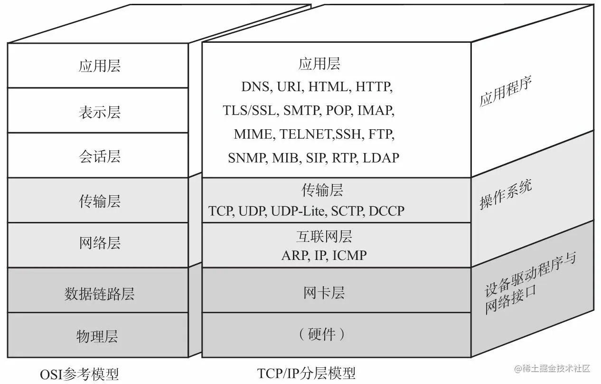
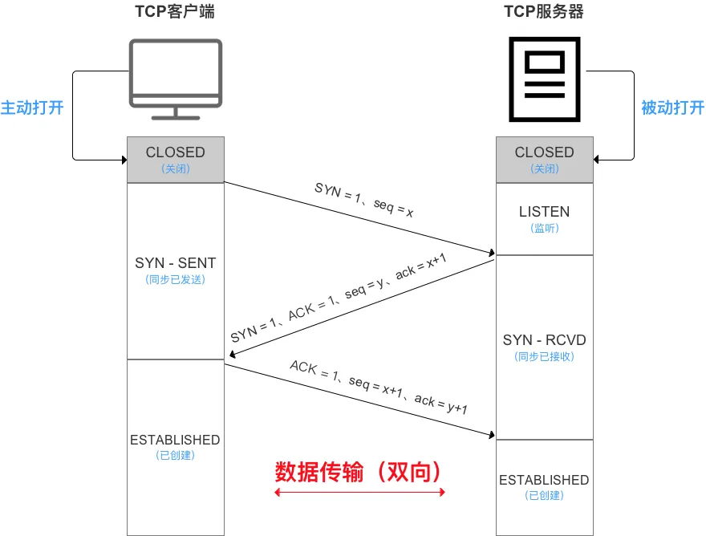
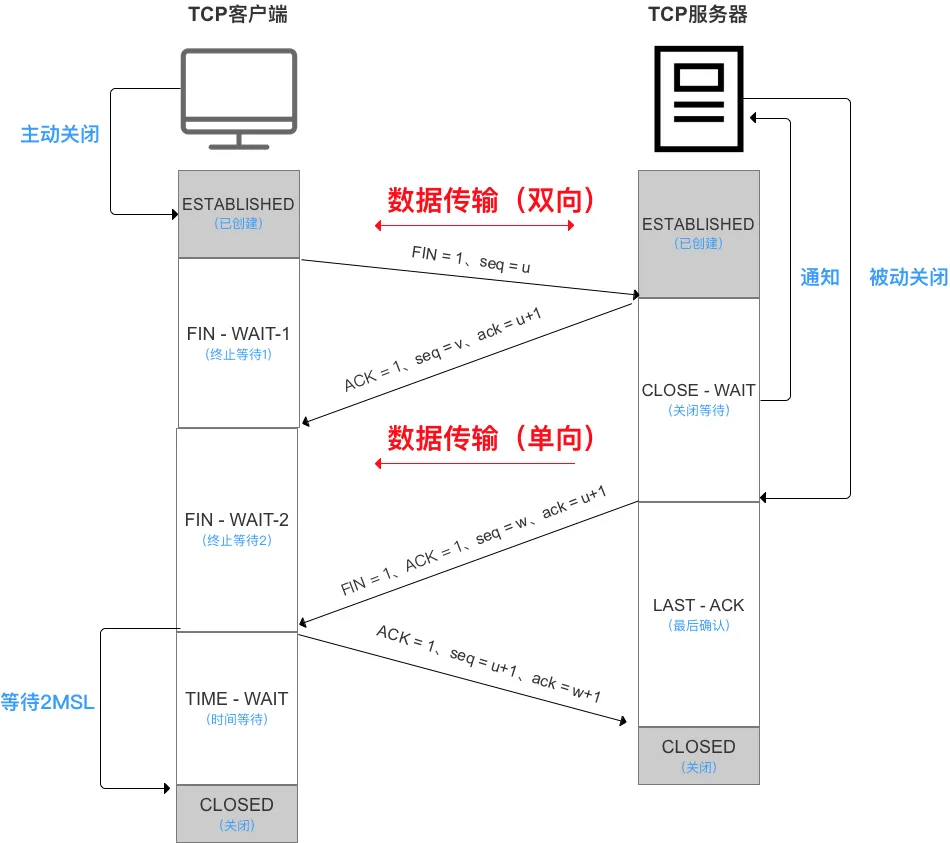

## tcp 网络模型 OSI网络模型



tcp 四层网络模型  应用层 传输层 网络层 数据链路层

OSI 七层网络模型  应用层 表示层 会话层 传输层 网络层 数据链路层 物理层

## tcp 三次握手



客户端 发送 SYN seq = x

服务端 接受到 后发送 SYN ACK ack = x+1 seq=y

客户端 接收后发送 ACK ack=y+1 seq=x+1

三次握手期间，任何一次未收到对面的回复，都会重发

面试问题

### 1. 为什么需要三次握手

原因1：编号 + 确认机制对应TCP 字段的 seq ACK；正式进行数据发送双方，需要对连接的建立进行确认和初始化
三次 

第一次 客户端发送 SYN 加自己的初始化序号 seq=x 

服务端收到后 第一次握手完成（客户端无法确认 ）（服务端 确认客户端 发送正常）

第二次 服务端 进行发送确认 ACK ack=x+1同时加上自己 的初始化序号 SYN seq=y 

客户端收到后 第二次握手完成（服务端 发送 和 接收能力都OK，但是服务端 还不知道 客户端 接收能力是否OK）

因此需要第三次握手，发送 ACK ack=y+1 

服务端接收到后，确认 （客户端接收能力正常）

小结：对 双方的 发送接受 能力进行确认

原因2：

如果使用两次，第一次客户端发送SYN 由于网络原因 没有接受到，这个SYN失效

然后客户端重新发送SYN 然后客户端ACK 两次就建立连接了

这个失效的SYN 突然又跑到 服务端了，服务端对这个失效的SYN 进行 ACK，建立连接，

然后服务端 就后续等待客户端数据，但是客户端又不会利用这个连接，造成资源浪费

如果三次握手 就还需要一次 客户端 ACK 才能连接，而对于失效的 SYN 是不会进行ACK 也就不会建立连接了，避免建立连接，资源浪费


## tcp 四次挥手



客户端 发送报文 FIN seq=u

服务端 收到发送 ACK seq=v ack=u+1 进入 CLOSE_WAIT

此时 服务器 可以向 客户端发送信息，单向传输; 客户端不再发送

服务端 发送报文 FIN ACK seq=w ack=u+1

客户端 发送报文 ACK seq=u+1 ack=w+1

客户端进入 TIME_WAIT状态

面试问题：

### 为什么TCP释放需要四次挥手？

这里进一步双方分为 主动方 被动方
主动方 首先发出请求 结束 FIN seq=u
被动方 确认 ACK ack=u+1 seq=v
此时主动方 不再发送数据，被动方可以继续发送数据 数据传输由双向 变为 单向

被动方需要结束时 发送 FIN seq=w ACK ack=u+1
主动方进行确认 发送 ACK ack=w+1 seq=u+1
发送后就进入 TIME_WAIT状态（保证如果 发送ACK报文丢失 被动方会重新发送他的FIN报文 此时还需要重新发送确认报文）
被动方收到后 直接进入 CLOSED状态

### 什么是 TIME_WAIT状态？作用是什么？ / 等待2MSL时间有什么用？

原因1：

保证如果 发送ACK报文丢失 被动方会重新发送他的FIN报文 此时还需要重新发送确认报文）

如果没有 TIME_WAIT 直接进入 CLOSED状态，如果发生丢失 服务器没有收到 服务器会重发 FIN报文 无法被确认 就会无法进入 CLOSED状态

设置 TIME_WAIT 或者说 等待 2MSL 保证如果丢失 服务重发可以确认 重新进入 2MSL计时，使服务器可以正常进入 CLOSED状态

小结：为了保证客户端发送的最后1个连接释放确认报文 能到达服务器，从而使得服务器能正常释放连接

原因2：

防止早已失效的连接请求报文 出现在本连接中 客户端发送了最后1个连接释放请求确认报文后，再经过2MSL时间，则可使本连接持续时间内所产生的所有报文段都从网络中消失。

MSL = 最长报文段寿命（Maximum Segment Lifetime）


### 服务器 CLOSE_WAIT 状态原因

关闭 socket 连接，我方忙于读或写，没有及时关闭连接

## keep-alive

TCP 保活机制 内核态

TCP连接一直没有数据交互，触发TCP保活机制，内核的TCP协议会发送 探测报文

如果对端程序是正常的。TCP保活探测报文发送给对端，对端会正常响应，TCP保活时间会被重置，等待下一个TCP保活时间到来

如果对端 主机掉线（）或其他原因导致报文不可达。TCP保活探测报文发送给对端，没有响应，连续几次，达到保活探测次数后，TCP会报告该TCP连接已经死亡

也就是，TCP keep-alive 是一种内核机制，用于在连接双方没有数据交互时，内核通过发送保活探测报文，确定TCP连接是否存活。

具体是通过 设置 SO_KEEPALIVE 实现的


```cpp
//on 是 1 表示打开 keepalive 选项，为 0 表示关闭，0 是默认值
int on = 1;
setsockopt(fd, SOL_SOCKET, SO_KEEPALIVE, &on, sizeof(on));

//发送 keepalive 报文的时间间隔
int val = 7200;
setsockopt(fd, IPPROTO_TCP, TCP_KEEPIDLE, &val, sizeof(val));

//两次重试报文的时间间隔
int interval = 75;
setsockopt(fd, IPPROTO_TCP, TCP_KEEPINTVL, &interval, sizeof(interval));

int cnt = 9;
setsockopt(fd, IPPROTO_TCP, TCP_KEEPCNT, &cnt, sizeof(cnt));

```

### 1. 建立连接后 client出现故障


## TCP 粘包问题

TCP协议是一种面向字节流的协议，它将应用程序的数据看成一连串的字节流。当应用程序向TCP协议栈发送数据时，TCP协议栈会将数据分段，然后封装成一个个的TCP报文发送出去。而在接收端，TCP协议栈会将收到的数据重新组装成字节流，然后交给应用程序。

TCP粘包是指在网络传输过程中，多个数据包在接收端被粘在一起，形成一个较大的数据包，导致应用程序无法正确地解析数据。

形象地说，就像我们把很多封信装进一个大信封里邮寄出去，对方收到后，打开信封发现所有的信都混在一起了。

### 为什么会发生TCP 粘包

- 发送方原因:
  - 发送方应用程序一次发送的数据量过小，不足以填满TCP发送缓冲区，多个小数据包会被TCP合并成一个大数据包发送。
  - 发送方应用程序发送数据的速度过慢，导致多个数据包在发送缓冲区中滞留，最终被一起发送出去。
- 接收方原因:
  - 接收方应用程序读取数据的速度过慢，导致多个数据包在接收缓冲区中堆积，应用程序一次读取时就拿到了多个数据包。
- 网络原因:
  - 网络拥塞、路由器缓存等因素也会导致数据包的延迟和重组，从而引发粘包问题。

### TCP粘包带来的影响
数据解析错误: 应用程序无法正确地解析接收到的数据，导致程序出现异常或错误。

数据丢失: 如果粘包严重，可能导致部分数据丢失。

性能下降: 应用程序需要花费额外的时间来处理粘包问题，降低了系统的性能。

### 如何解决TCP粘包问题

- 应用程序层解决:
  添加数据包边界: 在每个数据包的头部或尾部添加特定的标志，用于区分不同的数据包。

  固定数据包长度: 规定每个数据包的固定长度，便于接收方根据长度进行分割。

  使用自定义协议: 设计一个自定义协议，在协议中明确规定数据包的格式和长度。

  在接收端实现一个拆包器，根据协议规则将粘包的数据拆分开。

- TCP协议栈层解决:
  
  禁用Nagle算法: Nagle算法会将多个小数据包合并成一个大数据包发送，可以尝试禁用该算法。使用TCP_NODELAY选项关闭

- 应用程序框架的支持:
  
  使用一些网络编程框架，它们通常提供了内置的粘包拆包功能，可以简化开发。mina netty


## 如何理解TCP面向连接、面向字节流

面向连接

所谓的建立连接，是为了在客户端和服务端维护连接，而建立一定的数据结构来维护双方交互的状态，用这样的数据结构来保证所谓的面向连接的特性。


面向字节流
TCP 是面向字节流的。发送的时候发的是一个流，没头没尾。IP 包可不是一个流，而是一个个的 IP 包。之所以变成了流，这也是 TCP 自己的状态维护做的事情。而 UDP 继承了 IP 的特性，基于数据报的，一个一个地发，一个一个地收。


## 参考

https://juejin.cn/post/6992976378979319839#heading-28